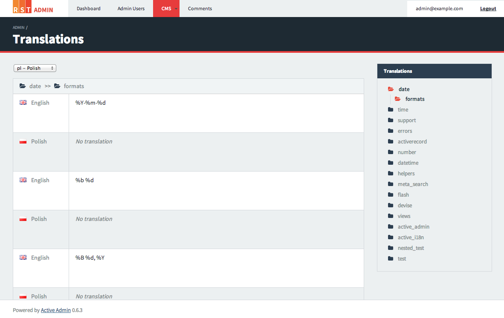

# ActiveI18n

ActiveI18n is an translation panel designed to work inside an activeadmin.

[](http://badge.fury.io/rb/active_i18n) [](https://codeclimate.com/github/rstgroup/active_i18n) [](https://travis-ci.org/rstgroup/active_i18n) [](http://rst-it.com) [](http://howwedoapps.com)

how it looks:

<a href="./screen.png"></a>

### ActiveAdmin and Rails version

This library was tested only on rails 3.2.x. with activeadmin 0.6.x Porting to 4.x rails version is in progress.

### Prerequisites

1. [activeadmin](http://activeadmin.info/) gem
2. [active_skin](https://github.com/rstgroup/active_skin) gem (optional for better looking)

### Installation

##### 0. make sure you have activeadmin installed

##### 1. add gems to your gemfile:
    
```ruby 
# gemfile
gem "activeadmin", "~> 0.6.3"
gem "active_skin" #for better looking
gem "active_i18n"
gem "redis" # when you are using Redis as a translations store
```

and bundle install

##### 2. add rails initializer

create file active_i18n.rb in config/initializers

```ruby
# config/initializers/active_i18n.rb
ActiveI18n.config(
  store: I18n::Backend::KeyValue.new(Redis.new),
  except: ["testtranslationkey", "date", "datetime"]
)
```

*store*:  sets translation store (in this example redis database)
*except*: removes some of the keys from the sidebar (optional)

If you are using redis you also will need to run the redis server `redis-server` in console

##### 3. define languages to translate

now having everything set up you could narrow the list of available languages (if not your users will see in selectboxes list of all available locales) and select base locale. You could do this in application.rb

```ruby
config.i18n.default_locale = :en
config.i18n.available_locales = [:en, :pl, :de] #placing :en again allows users to change default texts on your website
```

##### 4. add translation to the active admin menu

in your app/admin folder create new file called translations.rb (or whatever) 

```ruby
ActiveAdmin.register_translation "Translations", 
  :parent => "CMS",
  :priority => 2, 
  :label => "Translations"
```
hash is the same as in menu function in ActiveAdmin.

##### 5. add css and js

inside active_admin.js add active_i18n: 

```
...
//= require active_admin/base
...

//= require active_i18n

```

and inside active_admin.css.scss also add active_i18n: 
```scss
...
@import "active_admin/mixins";
@import "active_admin/base";
@import "active_skin";
...

@import "active_i18n";

```

##### and you are ready to go

## Contributing

1. Fork it ( http://github.com/rstgroup/active_i18n/fork )
2. Create your feature branch (`git checkout -b my-new-feature`)
3. Commit your changes (`git commit -am 'Add some feature'`)
4. Push to the branch (`git push origin my-new-feature`)
5. Create new Pull Request
