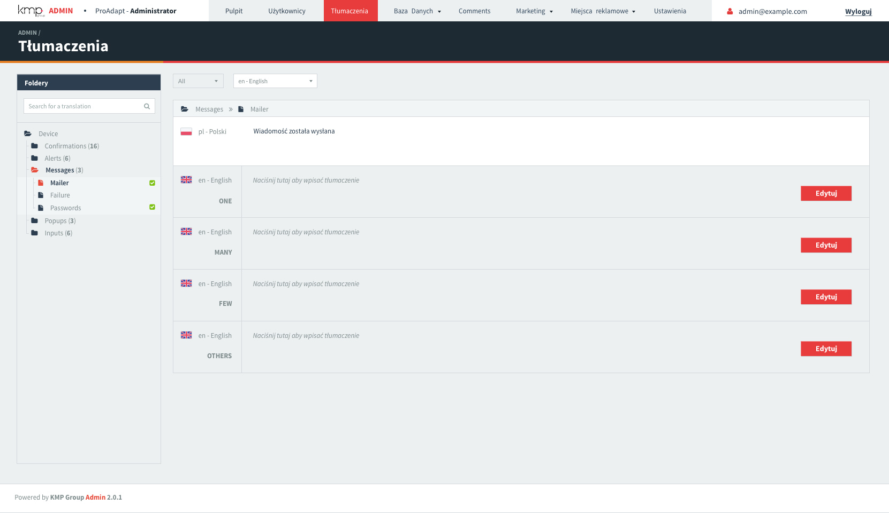
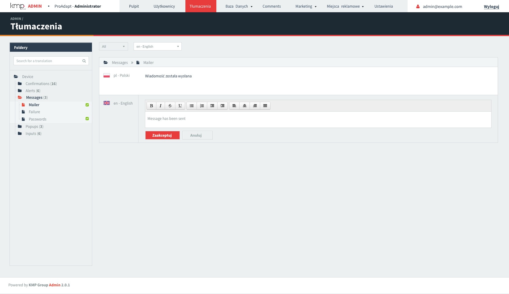
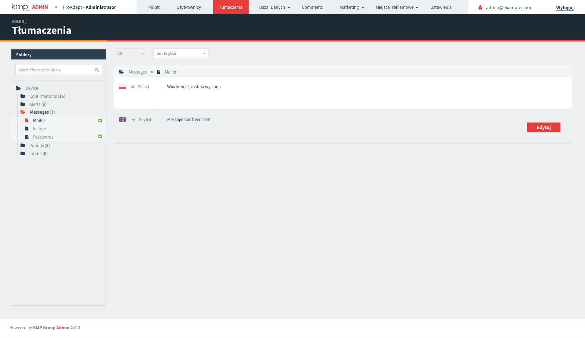

# Active::I18n

 

I18n translation panel for activeadmin. Currently in development.

# Sneak peek

Following designs assumes using of [active_skin gem](https://github.com/KMPgroup/active_skin)

<table>
  <tr>
    <td>
      
    </td>
    <td>
      
    </td>
  </tr>
  <tr>
    <td>
      
    </td>
    <td>
      
    </td>
  </tr>
</table>